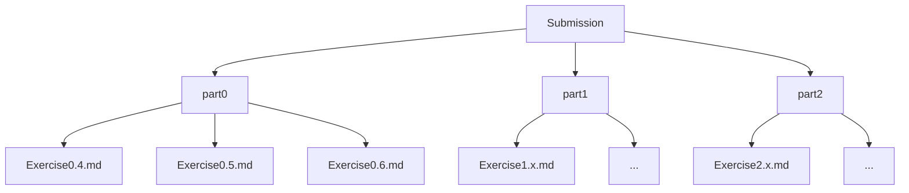

# Exercise Submission Repository

This repository contains all exercises organized clearly for submission.
## Organization Method
- Each part has its own dedicated folder (part0, part1, part2, etc.).
- Each exercise inside a part is named using its exercise number (e.g., Exercise0.4.md).
- All exercises are written in separate files.
- The naming convention follows the official exercise numbering format for clarity.
  

